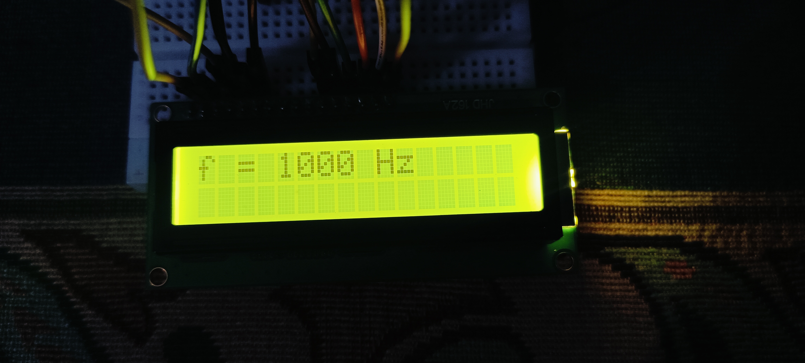
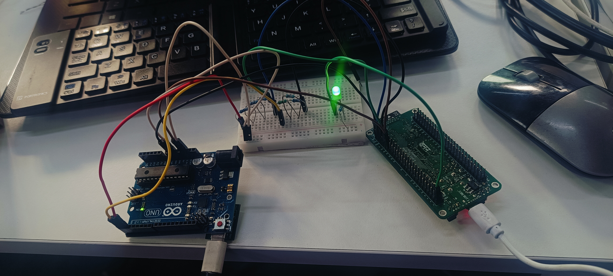
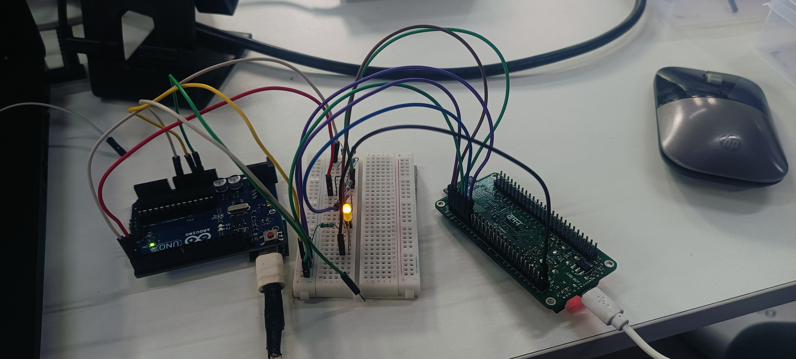
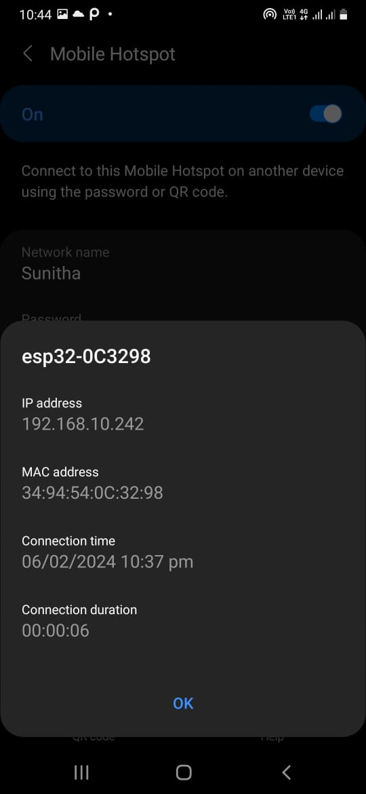
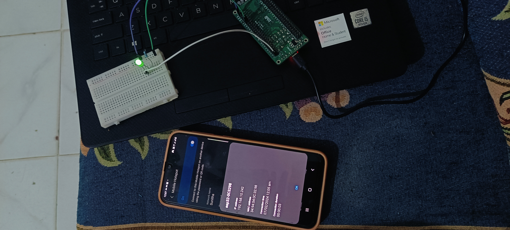

<div align="center">


# One Problem. Thirteen Platforms. Zero Compromises.

**The same GATE-level digital design question — solved, compiled, and hardware-verified**  
**across 13 different platforms using a single Android phone.**

<br>

[](LICENSE)
[](#platform-table)
[](https://iith.ac.in)
[](#gate-question)
[](#android-only)

<br>

[](arduino-uno/)
[](arduino-uno/assembly/)
[](arduino-uno/avr-gcc/)
[](arduino-uno/platformio/)
[](vaman/fpga/)
[](arm/)
[](vaman/esp32/)
[](latex/)

</div>

---

## What This Repository Proves

> This is not a tutorial project. This is not a simulation.  
> Every result here was produced on **real physical hardware**, compiled on a **phone**, flashed over **USB OTG or WiFi**, and photographed or recorded as proof.

A single question from the **GATE 2022** examination paper was taken and solved end-to-end on **13 different hardware and software platforms** — from the highest abstraction (Arduino C++) to the lowest (AVR register-level assembly), through FPGA fabric synthesis, ARM Cortex-M4 firmware, and wireless OTA deployment.

The entire development pipeline — writing, compiling, flashing, debugging — was executed **exclusively on an Android smartphone** using Termux, Neovim, and ArduinoDroid.

This demonstrates:
- **Depth** — from Arduino to bare-metal to FPGA to ARM RTOS
- **Breadth** — 13 platforms, 6 languages, 4 toolchains, 2 hardware families
- **Rigour** — 65 output recordings, 9 hardware photos, zero simulations
- **Ingenuity** — full professional dev environment built on a phone

---

## Who Built This

| | |
|:---|:---|
| **Name** | Tirumala Sai Nithin |
| **Employee ID** | FWC22187 |
| **Institution** | IIT Hyderabad — Future Wireless Communications (FWC) |
| **Supervisor** | Prof. G. V. V. Sharma — Associate Professor, Dept. of Electrical Engineering |
| **Internship** | Advanced 5G/6G Wireless Communications · Module 1 · Dec 2023 – Mar 2024 |
| **Current** | MSc Aerospace Engineering · University of Bristol · Class of 2026 |
| **Target roles** | Airbus · BAE Systems · Rolls-Royce · avionics & embedded systems |

---

## The GATE Question <a name="gate-question"></a>

### Problem 1 — IEEE-754 Floating Point Arithmetic

> **GATE 2022:** Consider three registers R1, R2, and R3 storing numbers in IEEE-754 single-precision floating-point format. R1 = `0x42200000`, R2 = `0xC1200000`. If R3 = R1 ÷ R2, what is the value stored in R3?

$$\texttt{R1} = \texttt{0x42200000} = +40.0_{(10)} \qquad \texttt{R2} = \texttt{0xC1200000} = -10.0_{(10)}$$

$$\boxed{R_3 = \frac{R_1}{R_2} = \frac{+40.0}{-10.0} = -4.0 = \texttt{0xC0800000}}$$

Implemented across **digital-design**, **FPGA**, **ARM**, **ESP32**, and all other platforms.

---

### Problem 2 — Boolean Function via Multiplexer

$$F(X,\, Y,\, Z,\, W) = \sum m(0,\, 1,\, 3,\, 11,\, 14)$$

Canonical expansion via MUX logic:

$$F = XYZ\overline{W} + X\overline{Y}ZW + \overline{X}\overline{Y}\overline{Z}W + \overline{X}\overline{Y}\overline{Z}\overline{W} + \overline{X}\overline{Y}WZ$$

Minimised form (K-Map, SOP):

$$F = \overline{X}\,\overline{Z} + YZ \quad \text{(verified on 7-segment, LED, LCD, and wireless)}$$

---

### Problem 3 — Counter Circuit Analysis (GATE IN 2022, Q46)

3-bit feedback shift register: $Q_0^{n+1} = \overline{Q_2^n}$, $Q_1^{n+1} = Q_0^n$, $Q_2^{n+1} = Q_1^n$

$$\text{State sequence: } 000 \to 001 \to 011 \to 111 \to 110 \to 100 \to 000$$

**Answer: Divide-by-5 counter** (5 unique states before repeat).

---

## Platform Table <a name="platform-table"></a>

<div align="center">

| # | Platform | Language | Toolchain | Output | Lines of Code |
|:-:|:---------|:---------|:----------|:-------|:-------------:|
| 1 | [**Digital Design — IEEE-754**](arduino-uno/digital-design/) | Arduino C++ | Arduino IDE | LCD JHD162A | ~60 |
| 2 | [**Seven Segment — Direct Drive**](arduino-uno/seven-segment/) | Arduino C++ | Arduino IDE | 7-Seg (7 pins) | ~150 |
| 3 | [**7447 IC — BCD Decoder**](arduino-uno/7447/) | Arduino C++ | Arduino IDE | 7-Seg via IC | ~25 |
| 4 | [**K-Map — Boolean Minimisation**](arduino-uno/k-map/) | Arduino C++ | Arduino IDE | 7-Seg via 7447 | ~35 |
| 5 | [**7474 IC — D Flip-Flop**](arduino-uno/7474/) | Arduino C++ | Arduino IDE | 7-Seg (sequential) | ~55 |
| 6 | [**AVR Assembly**](arduino-uno/assembly/) | ATmega328P ASM | AVRA assembler | LED pin 13 | ~35 |
| 7 | [**AVR-GCC — Bare Metal C**](arduino-uno/avr-gcc/) | C (no HAL) | avr-gcc + Make | LED sequence | ~60 |
| 8 | [**PlatformIO**](arduino-uno/platformio/) | Arduino C++ | PlatformIO CLI | LED via Boolean | ~30 |
| 9 | [**Finite State Machine**](arduino-uno/finite-state-machine/) | Arduino C++ | Arduino IDE | 7-Seg (FSM) | ~70 × 3 |
| 10 | [**GATE On Arduino**](arduino-uno/gate-on-arduino/) | Arduino C++ | Arduino IDE | LED Q0/Q1/Q2 | ~60 |
| 11 | [**ESP32 / VAMAN — Wireless OTA**](vaman/esp32/) | C++ (ESP-IDF) | PlatformIO + OTA | LED via WiFi | ~80 × 3 |
| 12 | [**FPGA / VAMAN — Verilog**](vaman/fpga/) | Verilog HDL | ql_symbiflow | LCD JHD162A | ~120 |
| 13 | [**ARM Cortex-M4**](arm/) | C (FreeRTOS) | arm-none-eabi-gcc | RGB LEDs | ~90 |
| + | [**LaTeX**](latex/) | LaTeX | pdflatex (Termux) | PDF documents | ~180 |

</div>

---

## Hardware Output Evidence

### Real hardware. Real results.

<table>
<tr>
<td align="center" width="33%">

**7-Segment Display**  
*7447 BCD Decoder IC driving digit output*


</td>
<td align="center" width="33%">

**FPGA → LCD**  
*Verilog state machine on QuickLogic EOS-S3*



</td>
<td align="center" width="33%">

**ESP32 Wireless OTA**  
*Boolean function deployed over WiFi hotspot*



</td>
</tr>
<tr>
<td align="center">

**ESP32 Wired Baseline**



</td>
<td align="center">

**OTA IP Verification**



</td>
<td align="center">

**Hotspot Logic Output**



</td>
</tr>
</table>

> 📹 **65 recordings** in [`outputs/`](outputs/) — hardware demos, Neovim workflows, LaTeX compilation, FPGA flash sequences.

---

## Built on Android. No PC. No Excuses. <a name="android-only"></a>

Every line of code in this repository was written, compiled, and flashed using only a smartphone.

```
Phone
 └── Termux (Android terminal)
      └── proot-distro login debian
           ├── nvim          ← all code written here
           ├── avra          ← AVR assembly compiler
           ├── avr-gcc       ← C cross-compiler for ATmega328P
           ├── make          ← Makefile builds
           ├── pio run       ← PlatformIO builds
           ├── arm-none-eabi-gcc  ← ARM Cortex-M4 compiler
           ├── ql_symbiflow  ← FPGA synthesis
           └── pdflatex      ← LaTeX compiler
 └── ArduinoDroid (Android app)
      └── Actions → Upload → Precompiled → .hex / .bin
           └── Connected via USB OTG cable
```

**Reference documents** in [`docs/`](docs/):
- [`nvim_shortcut_keys.pdf`](docs/nvim_shortcut_keys.pdf) — 2-page Neovim command reference
- [`nvim_and_arduinodroid_usage_notes.txt`](docs/nvim_and_arduinodroid_usage_notes.txt) — terminal commands per platform
- [`pin_lists.txt`](docs/pin_lists.txt) — LCD JHD162A + ESP32 DEVKIT V1 complete pin lists

---

## Key Technical Implementation Notes

### IEEE-754 Type Punning (C/C++)
```cpp
float R1_hex = 0x42200000;
float R1 = *(float*)&R1_hex;  // reinterpret hex bits as IEEE-754 float → +40.0
float R3 = R1 / R2;           // -4.0 = 0xC0800000
```

### AVR Assembly — NOR Gate (ATmega328P registers)
```asm
SBI  DDRB, 5         ; PB5 (pin 13) = OUTPUT
IN   r16, PIND       ; read port D (inputs)
ANDI r16, 0b00000100 ; mask input A (bit 2)
LSR  r16             ; shift right × 2 → bit 0
LSR  r16
LDI  r18, 0b00000001
EOR  r16, r18        ; NOT A
AND  r16, r19        ; AND with B → NOR result
LSL  r16             ; shift left × 5 → PB5
LSL  r16
LSL  r16
LSL  r16
LSL  r16
OUT  PORTB, r16      ; write to pin 13
RJMP start
```

### FPGA Verilog — LCD State Machine (QuickLogic EOS-S3)
```verilog
module helloworldfpga(output reg LCD_RS, output reg LCD_E, output reg[7:4] DATA);
    wire clk;
    qlal4s3b_cell_macro u_qlal4s3b_cell_macro (.Sys_Clk0(clk)); // 20 MHz

    // 41-state FSM: init → write "f = 1000 Hz" → wait 3ms → clear → repeat
    // 4-bit nibble mode | 800 clock cycles (40µs) per LCD enable strobe
```

### ARM Cortex-M4 — FreeRTOS Truth Table (VAMAN board)
```c
int truth_table[] = {0, 1, 3, 11, 14};  // Σm(0,1,3,11,14)
for (int i = 0; i < num_entries; i++) {
    int X = (truth_table[i] >> 3) & 0x1;
    PyHal_GPIO_Set(18, X);               // Blue LED
    PyHal_GPIO_Set(21, Y);               // Green LED
    PyHal_GPIO_Set(22, Z || W);          // Red LED
    HAL_DelayUSec(2000000);              // 2s per minterm
}
```

### ESP32 Wireless OTA — Boolean Function over WiFi
```cpp
void loop() {
    ArduinoOTA.handle();               // listen for OTA push
    int F = (!X && !Z) || (Y && Z);   // F = X'Z' + YZ
    digitalWrite(LED_F, F);
}
// Flash: pio run -t nobuild -t upload  (phone hotspot → VAMAN WiFi)
```

---

## Circuit Connections

### LCD JHD162A → Arduino Uno
```
Pin 1  VSS  → GND              Pin 2  VCC  → 5V
Pin 3  VEE  → GND (no pot)     Pin 4  RS   → Arduino D4
Pin 5  RW   → Arduino D5       Pin 6  EN   → Arduino D6
Pin 11 DB4  → Arduino D7       Pin 12 DB5  → Arduino D8
Pin 13 DB6  → Arduino D9       Pin 14 DB7  → Arduino D10
Pin 15 LED+ → 5V via 220Ω      Pin 16 LED- → GND
```

### SN7447 BCD Decoder → Arduino Uno
```
7447 Pin 7  (A/LSB) → Arduino D2    7447 Pin 1  (B)   → Arduino D3
7447 Pin 2  (C)     → Arduino D4    7447 Pin 6  (D/MSB)→ Arduino D5
7447 Pin 3  (LT)    → 5V            7447 Pin 4  (RBI)  → 5V
7447 Pin 5  (BI/RBO)→ 5V            7447 Pin 16 (VCC)  → 5V
7447 Pin 8  (GND)   → GND
```

### VAMAN ESP32 — Wired Upload Circuit (Arduino as UART bridge)
```
Arduino RST  ────────────────── VAMAN RST
Arduino TX   ──[1KΩ]──[1KΩ]──  VAMAN RX    (voltage divider: 5V→3.3V)
Arduino RX   ──[1KΩ]──[1KΩ]──  VAMAN TX
Arduino 3.3V ────────────────── VAMAN 3.3V
Arduino GND  ────────────────── VAMAN GND
             Hold EN (GPIO0) LOW during upload start; release after begun
```

---

## Repository Structure

```
fwc-iith-digital-design/
│
├── arduino-uno/                     ← 10 platforms on Arduino Uno
│   ├── digital-design/              ·  IEEE-754 float on LCD (1 .ino)
│   ├── seven-segment/               ·  Direct 7-seg drive (1 .ino, dice roll)
│   ├── 7447/                        ·  BCD decoder IC (1 .ino)
│   ├── k-map/                       ·  Boolean minimisation (2 .ino variants)
│   ├── 7474/                        ·  D flip-flop sequential (1 .ino)
│   ├── assembly/                    ·  ATmega328P ASM (2 .asm + 4 .hex)
│   ├── avr-gcc/                     ·  Bare-metal C (2 .c + Makefile)
│   ├── platformio/                  ·  PlatformIO CLI (main.cpp + .ini)
│   ├── finite-state-machine/        ·  FSM (3 .ino variants: 7447+7474, 7447, direct)
│   └── gate-on-arduino/             ·  GATE IN 2022 Q46 (2 .ino variants)
│
├── vaman/                           ← 2 platforms on VAMAN board
│   ├── esp32/                       ·  ESP32 WiFi OTA (3 .cpp programs + derivation doc)
│   └── fpga/                        ·  Verilog RTL (helloworldfpga.v + quickfeather.pcf)
│
├── arm/                             ← ARM Cortex-M4 (FreeRTOS + pygmy-sdk)
│   └── src/main.c
│
├── latex/                           ← LaTeX typesetting (pdflatex on Android)
│   ├── integration/src/             ·  7 CBSE calculus problems
│   ├── geometry/src/                ·  9 CBSE geometry problems
│   └── gate-in-2022/src/            ·  GATE IN 2022 Q46 with solution
│
├── questions/                       ← 7 GATE question images (PNG)
│
├── outputs/
│   ├── hardware-photos/             ← 9 photographs (real hardware)
│   ├── output-videos/               ← 17 hardware output recordings
│   ├── nvim-termux-videos/          ← 30 development workflow recordings
│   └── latex-recordings/            ← 9 LaTeX compilation recordings
│
└── docs/
    ├── methodology.md               ← Step-by-step for every platform
    ├── nvim_shortcut_keys.pdf        ← 2-page Neovim reference
    ├── nvim_and_arduinodroid_usage_notes.txt
    ├── pin_lists.txt                 ← LCD + ESP32 DEVKIT V1 pins
    └── internship-report/
        └── FWC_IITH_Internship_Report_Tirumala_Sai_Nithin.pdf
```

---

## Skills Demonstrated — For Recruiters

<table>
<thead>
<tr><th>Skill Domain</th><th>Evidence in This Repository</th><th>Relevance</th></tr>
</thead>
<tbody>
<tr>
<td><strong>Embedded C / C++</strong></td>
<td>Arduino IDE, AVR-GCC, PlatformIO, ESP32, ARM Cortex-M4 — 6 separate C/C++ implementations</td>
<td>Avionics software, flight control firmware</td>
</tr>
<tr>
<td><strong>Assembly Language</strong></td>
<td>ATmega328P NOR + NAND gates in AVR assembly — direct register manipulation, no HAL</td>
<td>Safety-critical systems, DO-178C low-level</td>
</tr>
<tr>
<td><strong>FPGA / RTL Design</strong></td>
<td>Verilog LCD state machine on QuickLogic EOS-S3 — synthesis, P&R, flash</td>
<td>Avionics FPGA (Xilinx, Altera), radar DSP</td>
</tr>
<tr>
<td><strong>Digital Logic Design</strong></td>
<td>K-Map minimisation, FSM design (Moore/Mealy), BCD decoders, D flip-flops</td>
<td>Digital circuit design for aerospace systems</td>
</tr>
<tr>
<td><strong>RTOS / Systems Programming</strong></td>
<td>FreeRTOS on ARM Cortex-M4 — task scheduling, GPIO HAL, UART debug</td>
<td>Flight management computers, embedded RTOS</td>
</tr>
<tr>
<td><strong>Wireless / IoT</strong></td>
<td>ESP32 WiFi OTA — ArduinoOTA library, hotspot deployment, IP verification</td>
<td>5G/6G embedded systems, connected avionics</td>
</tr>
<tr>
<td><strong>Build Systems & Toolchains</strong></td>
<td>Makefile (avr-gcc), PlatformIO CLI, ql_symbiflow, arm-none-eabi-gcc</td>
<td>Professional embedded toolchain proficiency</td>
</tr>
<tr>
<td><strong>Technical Documentation</strong></td>
<td>LaTeX mathematical typesetting, per-platform READMEs, methodology doc, 70-page report</td>
<td>Engineering reports, design documentation</td>
</tr>
<tr>
<td><strong>Resource Constraint Development</strong></td>
<td>Full embedded dev stack on Android phone — Termux, Neovim, no PC</td>
<td>Field deployment, resource-constrained environments</td>
</tr>
</tbody>
</table>

---

## Internship Certification

This work was completed as **Module 1 (Data Handling & Hardware Programming)** of the FWC programme at IIT Hyderabad.

- **IIT Hyderabad CCE Certificate** — Module-1, December 2023 – February 2024
- **FWC Internship Completion Certificate** — signed by Prof. GVV Sharma, 29 March 2024
- **Full 70-page internship report** — [`docs/internship-report/`](docs/internship-report/)

> *"He is extremely sincere and hardworking."*  
> — Prof. G. V. V. Sharma, Program Coordinator, IIT Hyderabad

---

## Evidence Count

| Category | Files | What They Show |
|:---------|------:|:---------------|
| Source code files | 33 | Working implementations across 13 platforms |
| GATE question images | 7 | The exact problems being solved |
| Hardware output photos | 9 | Real hardware producing correct results |
| Hardware output videos | 17 | Code running on physical hardware |
| Dev workflow recordings | 30 | Neovim → compile → flash on Android |
| LaTeX recordings | 9 | Mathematical typesetting on smartphone |
| Documentation files | 6 | Methodology, pin lists, Neovim reference |
| **Total** | **111+** | **No simulations. No screenshots. Real hardware.** |

---

## GitHub Repository Settings

```
Repository name : fwc-iith-digital-design

Description     : One GATE question solved across 13 platforms — Arduino, AVR Assembly,
                  AVR-GCC, PlatformIO, FSM, FPGA Verilog, ARM Cortex-M4, ESP32 OTA,
                  LaTeX — built entirely on Android · IIT Hyderabad FWC Internship 2024

Website         : https://github.com/SaiNithinTirumala-AerospaceEngineer

Topics (add all 20):
  arduino  embedded-systems  avr-assembly  fpga  verilog  arm-cortex-m4
  esp32  platformio  digital-design  finite-state-machine  iit-hyderabad
  gate  avr-gcc  latex  7447  7474  neovim  termux  freertos  bare-metal
```

---

<div align="center">

**[`arduino-uno/`](arduino-uno/)** &nbsp;·&nbsp; **[`vaman/`](vaman/)** &nbsp;·&nbsp; **[`arm/`](arm/)** &nbsp;·&nbsp; **[`latex/`](latex/)** &nbsp;·&nbsp; **[`outputs/`](outputs/)** &nbsp;·&nbsp; **[`docs/`](docs/)**

<br>

*Tirumala Sai Nithin · FWC22187 · IIT Hyderabad · 2024*  
*MSc Aerospace Engineering · University of Bristol · 2026*

</div>
