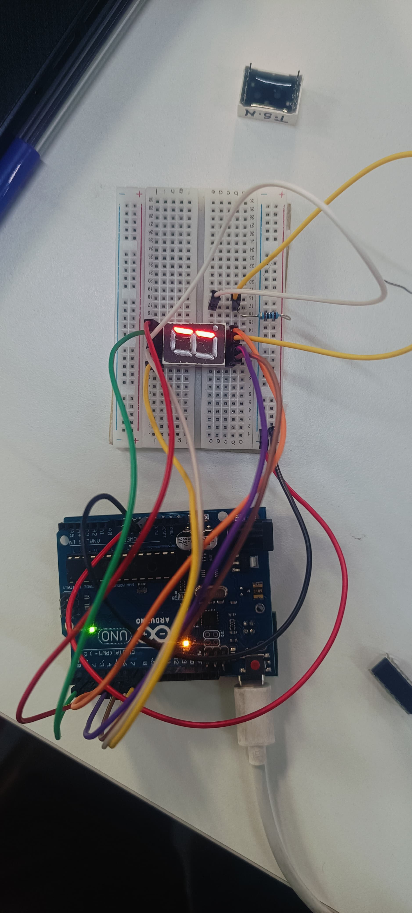

# Seven Segment Display — Direct Segment Drive (No Decoder IC)

**Platform:** Arduino Uno + Common-Cathode 7-Segment Display + Button + Buzzer  
**GATE Task:** Display digits 0–9 by directly controlling each segment pin  
**Toolchain:** Arduino IDE / ArduinoDroid

## How This Differs from the 7447 Platform

| Feature | This Platform (Direct) | 7447 Platform |
|---------|----------------------|---------------|
| IC required | None — Arduino drives segments directly | SN7447 decoder IC |
| Arduino pins used | 7 (one per segment a–g) | 4 (BCD input to IC) |
| Flexibility | Full control of every segment | Limited to digits 0–9 |
| Complexity | Higher (manual segment logic) | Lower (IC handles decode) |

## Pin Mapping

```
Segment  →  Arduino Pin
   a     →  D7
   b     →  D8
   c     →  D2
   d     →  D3
   e     →  D4
   f     →  D6
   g     →  D5
Button   →  A0  (INPUT_PULLUP)
Buzzer   →  D10
```

## Segment Encoding

```
     _
    |_|    a = top horizontal
    |_|    b = top-right vertical    f = top-left vertical
           c = bottom-right vertical e = bottom-left vertical
           d = bottom horizontal     g = middle horizontal
```

| Digit | a | b | c | d | e | f | g |
|-------|---|---|---|---|---|---|---|
| 0 | ON | ON | ON | ON | ON | ON | OFF |
| 1 | OFF| ON | ON | OFF| OFF| OFF| OFF|
| 2 | ON | ON | OFF| ON | ON | OFF| ON |
| 5 | ON | OFF| ON | ON | OFF| ON | ON |

## Key Feature — Dice Roll on Button Press

When button (A0) is pressed LOW:
```cpp
rollTheDice(10, 100);  // fast spin
rollTheDice(5,  200);  // slow down
rollTheDice(3,  300);
rollTheDice(1,  100);  // final result
```
Random number 1–6 shown with buzzer click each step.

## Output

  
*[Photo: Real hardware — single digit output on 7-segment display]*
